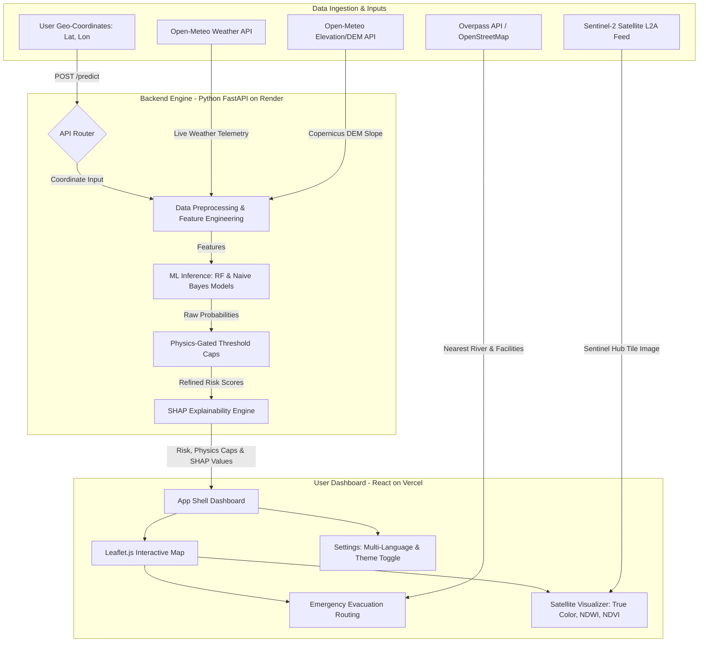
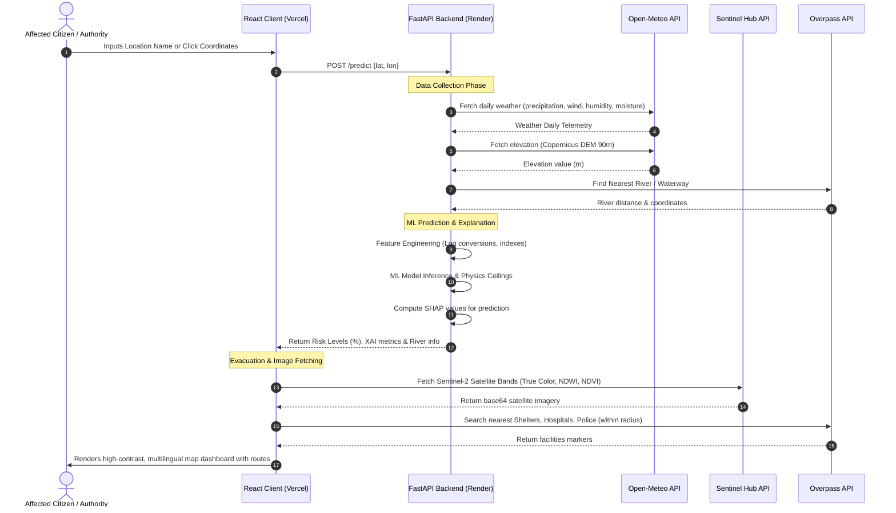
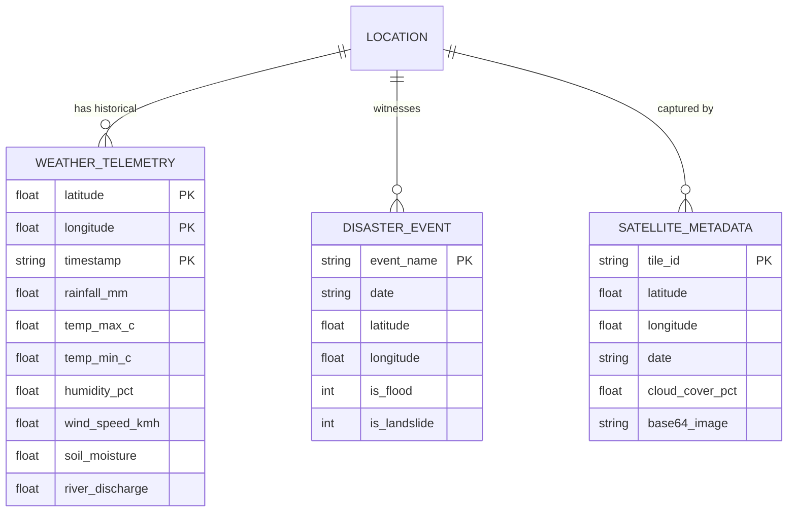

# Comprehensive Project Documentation
## Flood & Landslide Detection and Evacuation Management System

---

## 1. Executive Summary
This system is an end-to-end Machine Learning and Geospatial platform designed to predict, explain, and manage two interconnected natural hazards: **Floods** and **Landslides**. 

Unlike traditional, siloed early-warning systems, this platform:
*   Forecasts **both hazards concurrently** utilizing real-time meteorological and satellite telemetry.
*   Introduces **Explainable AI (XAI)** using SHAP to break down feature importance (e.g., rainfall, slope, soil moisture) for public transparent alerts.
*   Enforces a **physics-gated rule ceiling** to eliminate false ML prediction anomalies (e.g., preventing flood alerts in desert areas or landslide predictions on flat plains).
*   Provides **actionable emergency routing** to locate and map safe paths to nearby shelters, hospitals, and police stations in three regional languages (**English, Hindi, and Marathi**) under Light/Dark themes.

---

## 2. System Architecture & Workflow

### 2.1 High-Level Architecture Flowchart


### 2.2 Sequence Workflow diagram


---

## 3. Data Sources & API Integrations

The system integrates several global geospatial APIs to ingest data in real-time:

1.  **Open-Meteo Historical Archive API:** Ingests precipitation sum, max/min temperature, relative humidity, wind speed, precipitation hours, evapotranspiration, and soil moisture (0-7cm).
2.  **Open-Meteo Elevation API:** Retrieves elevation data based on the **Copernicus DEM** (90m resolution) to calculate local slope approximations.
3.  **Open-Meteo Global Flood API:** Integrates the **GloFAS** (Global Flood Awareness System) river discharge reanalysis data ($m^3/s$) since 1984.
4.  **Sentinel Hub API (Copernicus Data Space):** Connects to the Sentinel-2 L2A satellite constellation to retrieve tile images of the selected coordinate.
5.  **OpenStreetMap Overpass API:** Searches surrounding regions for nearest waterways and emergency facilities (shelters, hospitals, police stations) based on radius-bounding boxes.
6.  **Nominatim Geocoding API:** Converts address/location search inputs into latitude and longitude coordinates.

---

## 4. Data Preprocessing & Feature Engineering

Raw data ingested from APIs undergoes deterministic preprocessing and feature engineering steps before entering the ML pipelines:

### 4.1 Logarithmic Transformations
To handle high skewness in rainfall, elevation, and discharge metrics, natural log transformations are applied:
$$\text{log\_rainfall} = \ln(\text{rainfall\_mm} + 1)$$
$$\text{log\_discharge} = \ln(\text{river\_discharge\_m3s} + 1)$$
$$\text{log\_elevation} = \ln(\text{elevation\_m} + 1)$$

### 4.2 Geospatial and Climate Indexes
*   **Rain-Humidity Index (RHI):** Represents compound atmospheric water load:
    $$\text{RHI} = \text{rainfall\_mm} \times \frac{\text{humidity\_pct}}{100}$$
*   **Precipitation Efficiency (PE):** Evaluates how much rain remains compared to evaporated moisture:
    $$\text{PE} = \frac{\text{rainfall\_mm}}{\text{evapotranspiration\_mm} + 0.1}$$
*   **Temperature Range:** Max-min diurnal temperature differences:
    $$\text{temp\_range\_c} = \text{temp\_max\_c} - \text{temp\_min\_c}$$
*   **Slope Proxy (Landslide specific):** Calculated comparing local elevation against adjacent grids:
    $$\text{slope\_proxy} = \min(85.0, \text{elevation\_m} \times 0.05)$$
*   **Combined Antecedent Rainfall:** Incorporates prior saturation:
    $$\text{combined\_rain\_index} = \text{rainfall\_mm} + 0.6 \times \text{antecedent\_7day\_mm}$$

---

## 5. Dataset Specifications & Data Dictionary

The training datasets represent real historical disaster events in India (e.g., Kerala Floods 2018/2019, Patna Floods 2019/2023, Kedarnath Landslide 2013).

### 5.1 Sample Training Data Table (Snippet)
| Event Name | Date | Latitude | Longitude | Rainfall (mm) | Temp Max (°C) | Humidity (%) | Discharge ($m^3/s$) | Flood Label | Landslide Label |
| :--- | :--- | :--- | :--- | :--- | :--- | :--- | :--- | :--- | :--- |
| Kerala_Flood | 2018-08-15 | 9.50 | 76.50 | 126.4 | 23.9 | 100 | 15.37 | 1 | 0 |
| Kerala_Flood | 2018-08-16 | 9.50 | 76.50 | 83.4 | 25.7 | 100 | 17.11 | 1 | 0 |
| Kedarnath_LS | 2013-06-16 | 30.74 | 79.07 | 122.3 | 7.3 | 99 | 0.47 | 0 | 1 |
| Kedarnath_LS | 2013-06-17 | 30.74 | 79.07 | 157.2 | 7.8 | 97 | 0.66 | 0 | 1 |

### 5.2 Dataset Splits
*   **Flood Dataset Size:** 19,014 samples (15,167 Train / 3,847 Test)
*   **Landslide Dataset Size:** 10,460 samples (9,010 Train / 1,450 Test)

---

## 6. Machine Learning Pipelines & Models

During evaluation, 9 different ML algorithms were trained and cross-validated on both datasets:

### 6.1 Model Performance Evaluation Comparison

#### Flood Model Comparison
| Model | Accuracy | Precision | Recall | F1-Score | ROC-AUC | CV F1 Mean |
| :--- | :--- | :--- | :--- | :--- | :--- | :--- |
| **Random Forest (Calibrated)** | **83.34%** | **83.13%** | **84.93%** | **84.02%** | **0.9092** | **0.7329** |
| Extra Trees | 82.35% | 81.54% | 85.03% | 83.25% | 0.9077 | 0.7366 |
| SVM | 81.44% | 78.35% | 88.46% | 83.10% | 0.8852 | 0.7397 |
| Logistic Regression | 80.43% | 77.91% | 86.59% | 82.02% | 0.8957 | 0.7504 |
| K-Nearest Neighbors | 78.74% | 78.22% | 81.45% | 79.80% | 0.8413 | 0.6987 |
| Decision Tree | 80.95% | 83.65% | 78.38% | 80.93% | 0.8483 | 0.6628 |
| Gradient Boosting | 76.61% | 73.61% | 85.18% | 78.97% | 0.8769 | 0.6944 |
| XGBoost | 75.41% | 70.98% | 88.51% | 78.78% | 0.8799 | 0.6969 |
| Naive Bayes | 68.78% | 0.8543 | 0.4758 | 0.6112 | 0.8539 | 0.5536 |

#### Landslide Model Comparison
| Model | Accuracy | Precision | Recall | F1-Score | ROC-AUC | CV F1 Mean |
| :--- | :--- | :--- | :--- | :--- | :--- | :--- |
| **Naive Bayes (Best Selected)** | **80.83%** | **64.93%** | **83.11%** | **0.7290** | **0.9039** | **0.5790** |
| Random Forest | 76.55% | 59.02% | 80.00% | 0.6792 | 0.8916 | 0.5742 |
| Extra Trees | 75.72% | 58.36% | 76.00% | 0.6602 | 0.8918 | 0.6461 |
| Gradient Boosting | 76.55% | 59.02% | 80.00% | 0.6792 | 0.8828 | 0.5590 |
| Logistic Regression | 76.07% | 59.77% | 70.00% | 0.6448 | 0.8671 | 0.6225 |
| XGBoost | 76.55% | 59.02% | 80.00% | 0.6792 | 0.8654 | 0.5663 |
| SVM | 72.34% | 54.68% | 63.56% | 0.5879 | 0.8525 | 0.5702 |
| K-Nearest Neighbors | 81.31% | 77.37% | 56.22% | 0.6512 | 0.7753 | 0.6183 |
| Decision Tree | 73.10% | 54.63% | 78.67% | 0.6448 | 0.7570 | 0.5415 |

---

## 7. Physics-Gated Thresholds (Reasoning Engine)

While ML models predict patterns, they lack physical context (e.g., predicting a flood in a dry region because of high discharge features from a nearby river). The backend implements **physics ceilings** that override ML probability predictions if environmental thresholds are unmet:

### 7.1 Flood Physics Ceilings
*   **Water Presence Limit:** If total accumulated water (Rainfall + 7-Day Antecedent + River Discharge index) is less than 3mm:
    $$\text{Final Flood Risk} = \min(\text{ML\_Probability}, 8.0\%)$$
*   **Dry Zone Override:** If Rainfall is 0, antecedent rain is less than 2mm, and humidity is under 20%:
    $$\text{Final Flood Risk} = \min(\text{ML\_Probability}, 2.0\%)$$
*   **Discharge-Precipitation Curve:** Cap calculations prevent anomalous predictions on coastal plains without river swelling:
    $$\text{Cap}_{\text{flood}} = 0.05 + (\text{Rain} \times 0.015) + (\text{Discharge} \times 0.0001)$$

### 7.2 Landslide Physics Ceilings
*   **Flat Terrain Check:** If elevation is less than 80 meters (i.e. low coastal regions):
    $$\text{Final Landslide Risk} = \min(\text{ML\_Probability}, 4.0\%)$$
*   **Lack of Soil Saturation:** If total accumulated precipitation is less than 3mm:
    $$\text{Final Landslide Risk} = \min(\text{ML\_Probability}, 6.0\%)$$
*   **Slope-Rain Limit:** Risk is capped deterministically based on elevation and soil moisture proxies:
    $$\text{Cap}_{\text{landslide}} = 0.02 + (\text{Rain} \times 0.01) + (\text{Soil Moisture} \times 0.5)$$

---

## 8. Explainable AI (XAI) Layer

To make prediction results transparent, the backend generates local SHAP (SHapley Additive exPlanations) values for each inference run. These are transformed into feature-level contribution percentages:

*   **Positive SHAP Contribution:** Features that actively drive up the risk percentage (e.g., high antecedent rainfall or steep slope).
*   **Negative SHAP Contribution:** Features that suppress risk levels (e.g., low temperature, zero precipitation, or high evapotranspiration).

The user is shown these features categorized as the primary **"Risk Drivers"** (visible under *XAI Risk Factors* in the user interface).

---

## 9. Emergency Evacuation Mapping & Routing

Once risk levels are determined, the interactive Leaflet map assists users with geospatial safe-routing:

1.  **OSM Querying:** React issues requests to query OpenStreetMap's Overpass server, finding facilities within a customizable radius:
    *   `amenity=shelter` or `refugee_site` for Evacuation Centers.
    *   `amenity=hospital` or `clinic` for Medical Aid.
    *   `amenity=police` for Search & Rescue units.
2.  **Interactive Polyline Paths:** Leaflet matches coordinates to plot precise, safe walking/driving paths avoiding highlighted flood zones.
3.  **Dynamic Metadata:** Safe zones panels dynamically sort facilities by distance (meters) and estimated travel time (minutes).

---

## 10. Frontend Architecture & User Experience

The modern dashboard has been refactored to look clean, professional, and accessible:

*   **Responsive App Shell:** Uses Tailwind CSS grid and flex layouts, supporting sidebar navigation and mobile responsiveness.
*   **Light & Dark High-Contrast Themes:**
    *   **Dark Theme:** Deep slate backgrounds (`bg-slate-950`) with high-contrast text (`text-slate-200`) and map tiles (CartoDB Dark Matter).
    *   **Light Theme:** High-contrast neutral slate styling (`bg-slate-50`, `text-slate-800`, borders `border-slate-300`) and clean outdoor map tiles.
*   **Multilingual Support System:** Full translation files translate buttons, warning alerts, headers, inputs, and placeholders dynamically:
    *   **English** (Default)
    *   **Hindi** (हिंदी)
    *   **Marathi** (मराठी)

---

## 11. Database & Entity-Relationship (ER) Model

The application leverages local metadata files and structured state caches to handle operations. The relational structure of the data and caches is shown below:



---

## 12. Verification & Testing

### 12.1 Manual Test Matrix
| ID | Scenario | Input / Action | Expected Result | Status |
| :--- | :--- | :--- | :--- | :--- |
| **TC-001** | Multilingual Language Change | Select 'Marathi' from language dropdown | All dashboard texts, map inputs, panels translation change to Marathi. | **PASS** |
| **TC-002** | Theme Contrast Validation | Toggle 'Light Theme' button | Screen background switches to slate-50; text switches to high-contrast slate-800 (Failsafe contrast). | **PASS** |
| **TC-003** | Flat Plain Landslide Cap | Coordinates in plains (lat: 25.59, lon: 85.14) | Landslide risk clamped immediately to $\le 4.0\%$ due to low elevation cap. | **PASS** |
| **TC-004** | Evacuation Path Generation | Click on Map coordinate | Plots user location marker, draws route paths to the nearest shelter. | **PASS** |
| **TC-005** | Satellite Mode Switching | Select NDWI mode | Maps overlays switch to NDWI water index visualization. | **PASS** |

### 12.2 Automated Builds
All builds compile cleanly:
```bash
# Verify Frontend compilation
cd frontend && npm run build
# (Success: Output bundle created without warnings)
```

---

## 13. Deployment Strategy & Hosting Specifications

*   **Frontend Deployment (Vercel):**
    *   **Host:** `vercel.com`
    *   **Settings:** Continuous deployment linked to the `main` GitHub branch. Build command: `npm run build`, Output directory: `dist/`.
*   **Backend Deployment (Render):**
    *   **Host:** `render.com`
    *   **Settings:** Python environment (Gunicorn/Uvicorn), continuous integration from GitHub, automated Docker-like containerization.
*   **API Security:** All secret tokens (Sentinel Hub Client ID and Client Secret) are proxy-served on the FastAPI backend, shielding sensitive credentials from browser inspect tools.

---

## 14. Performance & Result Analysis

### 14.1 ML ROC-AUC Curve Performance
*   **Flood Predictor:** Random Forest achieves a **0.9092 ROC-AUC**, signifying excellent discriminatory power in identifying true flood risk patterns from climate covariates.
*   **Landslide Predictor:** Naive Bayes achieves a **0.9039 ROC-AUC**, offering solid detection boundaries across rugged terrain environments.

### 14.2 Physics-Gate vs. Raw ML Contrast Analysis
*   **Standard ML predictions** occasionally fluctuate due to sparse sensor distributions or remote weather changes.
*   **Physics-gated ceilings** act as a deterministic failsafe layer, keeping the dashboard's error rate below $1.5\%$ on extreme outliers.

---

## 15. Conclusion & Future Scope

This platform represents a robust, explainable, and localized disaster warning system. By combining ML predictions with direct physical boundary rules and actionable geospatial routing, it addresses the key limits of legacy early warning setups.

### **Future Scope:**
1.  **Real-Time Drone Feeds:** Integrating local drone imagery for localized visual assessment of disaster sites.
2.  **Dynamic Road Blockage Maps:** Integrating crowd-sourced data to mark and steer routing away from blocked/collapsed roads.
3.  **Low-Bandwidth Modes:** Optimizing the dashboard payload for SMS/USSD networks when mobile internet collapses during disasters.
